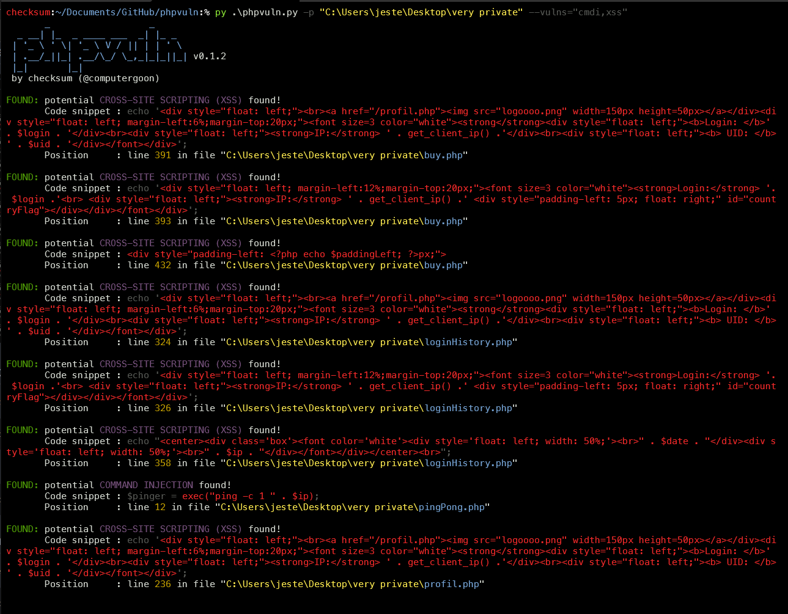

# phpvuln

[](https://www.python.org/) [](https://ares.tools)

phpvuln is an open source OWASP penetration testing tool written in Python 3, that can speed up the the process of finding common PHP vulnerabilities in PHP code, i.e. command injection, local/remote file inclusion and SQL injection.

## Screenshot



## Installation

You can download phpvuln by cloning the Git repository:

``` bash
git clone https://github.com/ecriminal/phpvuln.git
```

Install the required PIP packages:

``` bash
python -m  pip install -r requirements.txt
```

## Usage

To get the list of all options use:

``` bash
python phpvuln.py -h
```

## Contributors

checksum

* [Twitter](https://twitter.com/elordcs)

_I'm currently looking for contributors to help improve phpvuln. Contact me on Discord, if you're interested :-)_
